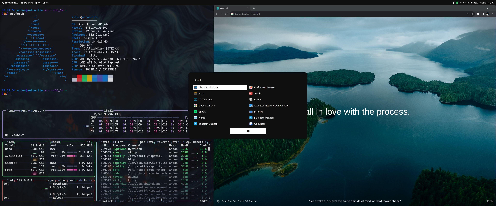
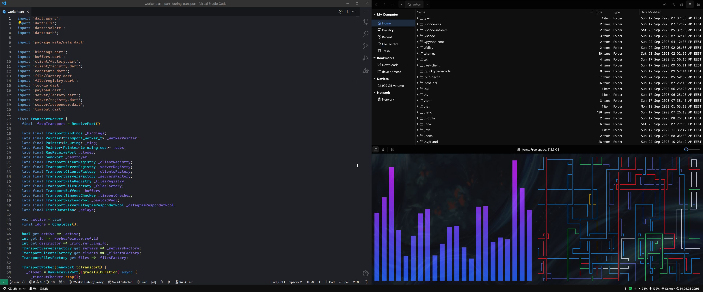

# Components

* OS Arch Linux
* kitty
* waybar
* hyprland
* refind
* rofi
* sddm
* gtklock
* cliphist
* nemo
* grim + slurp
* swww
* mako

## Themes

* GTK Theme - Colloid-Dark
* GTK Icons - Colloid-Dark
* GTK Cursor - elementary
* SDDM - sddm-astronaut-theme customized
* bahsrc prompt - My own
* Fonts - Segoe UI & CaskaydiaCove
* Other - Black & White contrast

## Screenshots

